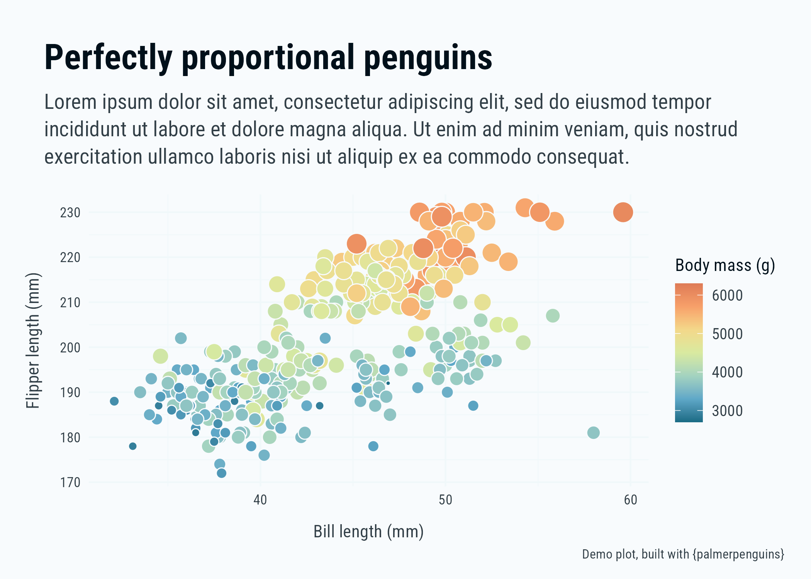

<!-- README.md is generated from README.Rmd. Please edit that file -->

# tealviz <a href="https://t-emery.github.io/tealviz/"></a>

<!-- badges: start -->
<!-- badges: end -->

`tealviz` is a collection of data visualization tools for [Teal
Emery](https://www.tealemery.com/) + [Teal
Insights](https://www.linkedin.com/company/teal-insights/?viewAsMember=true).
The package is publicly available on GitHub with a permissive (MIT)
license to facilitate the reproducibility of Teal Emery + Teal Insights
analysis. I kindly ask that you don’t use it for your own work, however
you are welcome to use the code as a building block to create your own
data viz package.

This package builds upon a package that [Cara
Thompson](https://www.cararthompson.com/) helped me build. I’m a
researcher, not an artist, so having such a skilled designer help me
build this package was a huge help. I highly recommend her work. The
inspired coding & visual design work are hers. The mistakes are mine.

## Installation

You can install the development version of tealviz from
[GitHub](https://github.com/) with:

``` r
devtools::install_github("t-emery/tealviz")
```

### Fonts

`tealvis` assumes that the user has fonts installed on their computer.
The package will not install fonts for you. If you do not have the fonts
installed, the package will not work. The fonts used in this package
are: `Roboto`, `Roboto Condensed`, `Lora`, and `Lora Bold`. You can
install them from [Google Fonts](https://fonts.google.com/). They are
also available as assets in the `tealviz` package. You can find them in
the `inst/assets/fonts` folder of the GitHub repo. You can install them
with the `extrafont` package.

Fonts are tricky in R. If you’re having trouble, read this [excellent
explainer by June
Choe](https://yjunechoe.github.io/posts/2021-06-24-setting-up-and-debugging-custom-fonts/).

## Example

The core of the `tealviz` package is a series of `ggplot2` custom
themes, and custom colors/palettes.

``` r
library(tealviz)
#> Successfully hoisted 6 font(s) for the family 'Roboto': Roboto Bold, Roboto Italic, Roboto Bold Italic, Roboto Regular, Roboto Regular, Roboto Bold
#> The following font(s) for the family 'Roboto' are already loaded: Roboto Medium
#> Successfully hoisted 6 font(s) for the family 'Roboto Condensed': Roboto Condensed Italic, Roboto Condensed Light Italic, Roboto Condensed Bold Italic, Roboto Condensed Bold, Roboto Condensed Light, Roboto Condensed Regular
#> Successfully hoisted 8 font(s) for the family 'Lora': Lora Italic, Lora SemiBold Italic, Lora Regular, Lora Bold, Lora SemiBold, Lora Medium Italic, Lora Medium, Lora Bold Italic
#> Successfully hoisted 8 font(s) for the family 'Inconsolata': Inconsolata Bold, Inconsolata SemiBold, Inconsolata Light, Inconsolata Medium, Inconsolata ExtraLight, Inconsolata Black, Inconsolata Regular, Inconsolata ExtraBold
# On loading the package, the `font_hoist()` function automatically makes sure the fonts are available for use. You will see messages in the console to inform you whether the fonts loaded correctly or not. 
library(ggplot2)
#> Warning: package 'ggplot2' was built under R version 4.3.1

palmerpenguins::penguins |>
  ggplot() +
  geom_point(aes(x = bill_length_mm,
                 y = flipper_length_mm,
                 size = body_mass_g,
                 fill = body_mass_g),
             shape = 21,
             color = ti_colors$background) +
  labs(title = "Perfectly proportional penguins",
       subtitle = "Lorem ipsum dolor sit amet, consectetur adipiscing elit, sed do eiusmod tempor incididunt ut labore et dolore magna aliqua. Ut enim ad minim veniam, quis nostrud exercitation ullamco laboris nisi ut aliquip ex ea commodo consequat.",
       x = "Bill length (mm)",
       y = "Flipper length (mm)",
       fill = "Body mass (g)",
       caption = "Demo plot, built with {palmerpenguins}") +
  guides(size = "none") +
  scale_fill_ti(continuous = TRUE) +
  theme_ti(title_font = "Roboto Condensed Bold",
           base_font = "Roboto Condensed",
           background_color = TRUE,
           void = FALSE) 
#> Warning: Removed 2 rows containing missing values (`geom_point()`).
```


